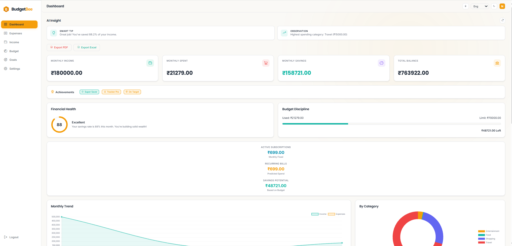
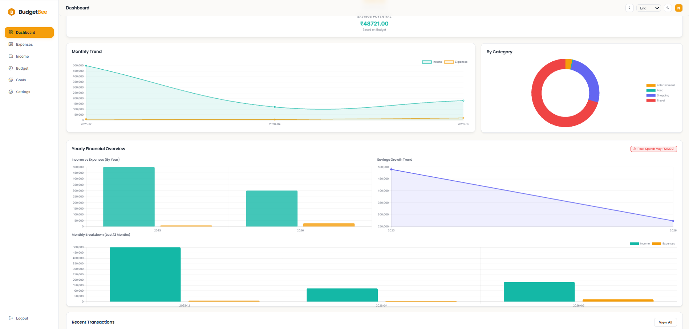
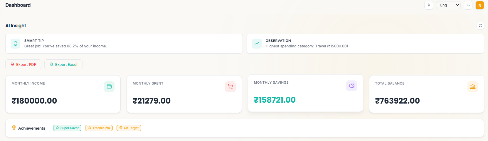
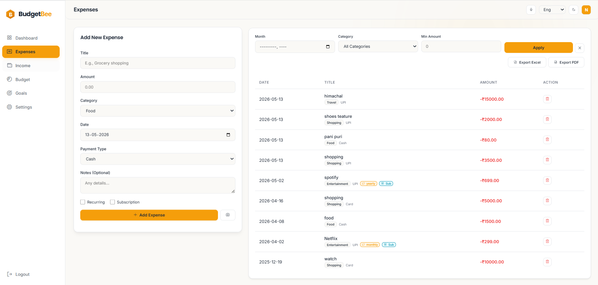
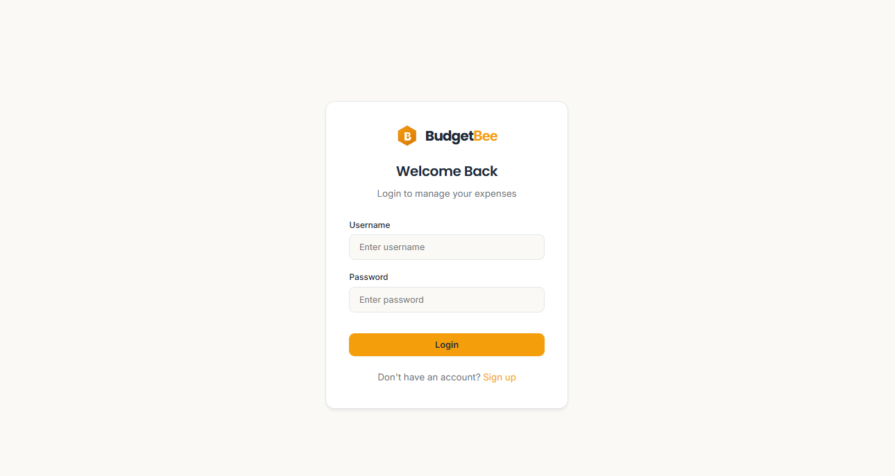

# 🐝 BudgetBee: Smart Spending Made Simple

[](https://flask.palletsprojects.com/)
[](https://www.sqlite.org/)
[](https://ai.google.dev/)
[](LICENSE)

**BudgetBee** is a professional-grade, AI-powered personal finance management web application designed to empower users with smarter spending habits. Built with a focus on modern fintech aesthetics and user experience, BudgetBee combines traditional financial tracking with state-of-the-art AI insights and OCR technology to provide a comprehensive view of your financial health.

---

## 📸 Dashboard Preview

<div align="center">
  
  <p><i>The central hub for your financial overview, featuring real-time statistics and AI-generated advice.</i></p>
</div>

---

## ✨ Core Features

### 📊 Intelligent Analytics
Visualize your financial journey with precision. BudgetBee utilizes **Chart.js** to deliver dynamic, interactive visualizations including:
- **Monthly Trends**: Compare income vs. expenses over time.
- **Category Breakdown**: Understand exactly where your money goes.
- **Yearly Projections**: True yearly aggregation for long-term financial planning.

### 🤖 AI Financial Advisor
Leveraging Google's **Gemini 1.5 Flash API**, BudgetBee analyzes your spending patterns to provide:
- Personalized saving recommendations.
- Alerts on overspending in specific categories.
- Actionable financial tips tailored to your current budget.

### 📸 OCR Receipt Scanning
Forget manual entry. Simply snap a photo of your receipt, and our integrated **Tesseract OCR** engine will automatically extract the merchant name, date, and total amount, populating your expense form instantly.

### 🎯 Goal Tracking & Budgeting
- **Smart Goals**: Set targets for your next vacation or a house down payment. Track your progress with interactive bars.
- **Dynamic Budgeting**: Set monthly limits and monitor your utilization in real-time.
- **Recurring Transactions**: Automatically track subscriptions and fixed monthly costs.

### 🎤 Seamless Interaction
- **Voice Input**: Add transactions hands-free using integrated speech recognition.
- **Multilingual Support**: Fully localized for English, Hindi, and Telugu.
- **Dark/Light Mode**: A premium, theme-aware UI that adapts to your environment.

---

## 🛠️ Tech Stack

| Component | Technology |
| :--- | :--- |
| **Backend** | Python / Flask |
| **Database** | SQLite (Production-ready schema) |
| **Frontend** | HTML5 / CSS3 / JavaScript (ES6+) |
| **Charts** | Chart.js |
| **AI Engine** | Google Gemini API |
| **OCR** | Pytesseract / Pillow |
| **Exports** | ReportLab (PDF) / Openpyxl (Excel) |
| **Design** | Phosphor Icons / Custom CSS Grid System |

---

## 🚀 Installation & Setup

### Prerequisites
- Python 3.8 or higher
- [Tesseract OCR Engine](https://github.com/tesseract-ocr/tesseract) (for receipt scanning)

### 1. Clone the Repository
```bash
git clone https://github.com/Thotaneha007/BudgetBee.git
cd BudgetBee
```

### 2. Set Up Virtual Environment
**Windows:**
```bash
python -m venv venv
venv\Scripts\activate
```
**Mac/Linux:**
```bash
python3 -m venv venv
source venv/bin/activate
```

### 3. Install Dependencies
```bash
pip install -r requirements.txt
```

### 4. Configure Environment Variables
Create a `.env` file in the root directory and add the following:
```env
SECRET_KEY=your_secure_flask_key
GEMINI_API_KEY=your_google_gemini_api_key
```

### 5. Run the Application
```bash
python run.py
```
Visit `http://127.0.0.1:5000` in your browser.

---

## 📂 Project Structure

```text
BudgetBee/
├── app/
│   ├── routes/          # Flask Blueprints (Auth, API, Expenses, Income, etc.)
│   ├── static/          # CSS Design Tokens, Vanilla JS, and Assets
│   ├── templates/       # Localized Jinja2 HTML Templates
│   ├── utils/           # AI, OCR, and PDF/Excel logic
│   └── __init__.py      # App factory & Database initialization
├── run.py               # Main entry point
├── config.py            # App configurations
├── schema.sql           # Database structure
└── requirements.txt     # Dependency list
```

---

## 🖼️ Application Gallery

<div align="center">
  <table>
    <tr>
      <td><br><p align="center">Advanced Analytics</p></td>
      <td><br><p align="center">AI Financial Advice</p></td>
    </tr>
    <tr>
      <td><br><p align="center">Transaction Management</p></td>
      <td><br><p align="center">Secure Authentication</p></td>
    </tr>
  </table>
</div>

---

## 💡 The Vision
BudgetBee was inspired by the need for a financial tool that doesn't just record data, but *understands* it. Most finance apps feel like spreadsheets; BudgetBee is designed to feel like a financial companion. The goal was to bridge the gap between complex banking software and simple manual logs using the power of Generative AI.

---

## 📈 Future Roadmap
- [ ] **Bank Sync**: Integration with Plaid for automated transaction importing.
- [ ] **ML Spending Predictions**: Use historical data to predict next month's utility bills.
- [ ] **Push Notifications**: Low-budget alerts and recurring payment reminders.
- [ ] **PWA Support**: Full offline data entry and mobile app-like experience.

---

## 📄 License
This project is licensed under the MIT License - see the [LICENSE](LICENSE) file for details.

---

<div align="center">
  <p>Built with ❤️ by <a href="https://github.com/Thotaneha007">Neha</a></p>
  <p><i>Empowering your financial freedom, one bee at a time.</i></p>
</div>
